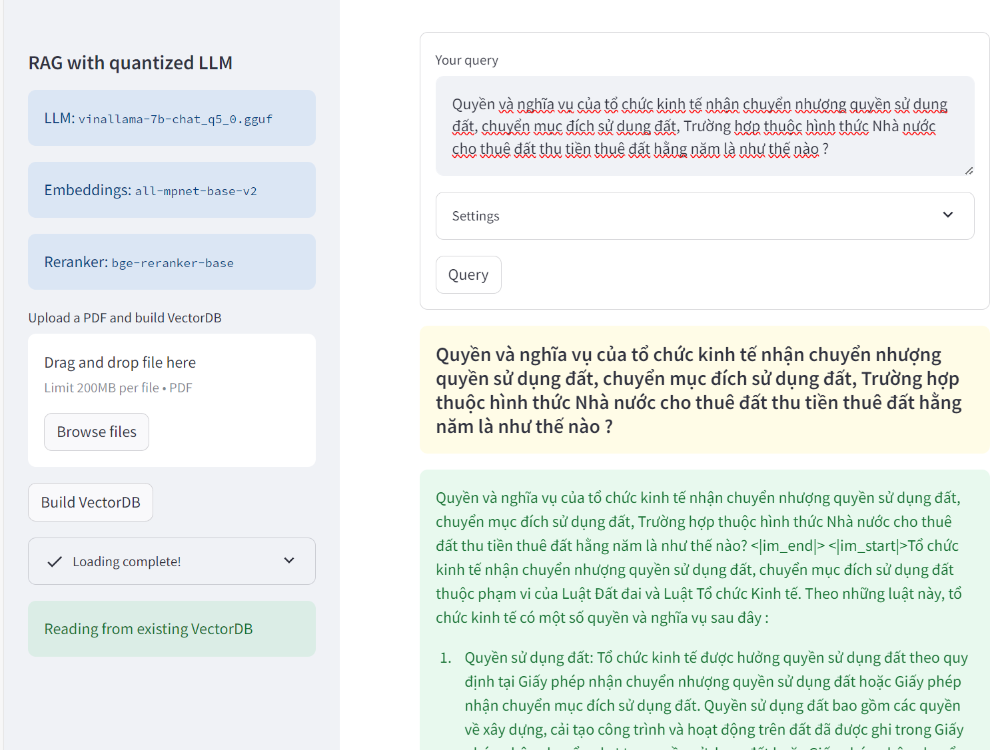

# K32 Thạc sĩ khoa học dữ liệu. Khai thác văn bản và ứng dụng, project retrieval-augmented-generation, RAG cho luật đất đai

Giảng Viên: TS. Ngô Minh Mẫn

Học Viên: Trần Hoàng Vũ 22C01027

Học Viên: Mai Đức Toàn 22C01036

Học Viên: Lê Thị Thanh Xuân 22C01028

Học Viên: Nguyên Minh Trí 20C29017


Ứng dụng chatbot Retrieval augmented generation (RAG) với Vinallama2 và multilingual embedding
 (LLms cho tiếng việt) và llama2 và NLLB

ứng dụng cho phép người dùng thực hiện.
- Hỏi đáp thông tin QA
- Nhận thông tin của dữ liệu file văn bản mới, hỗ trợ trả lời câu hỏi cho LLMs (giảm sự ảo giác và kiến thức chưa được cập nhật)
- So sánh kết quả với văn bản luật

## 🔧 Thực hiện tạo enviroment riêng, thực hiện trên pycharm


### Download model artefacts

Tải và save the models trong `./models` và update `config.yaml`. Model sử dụng với các đường dẫn sau.
- Embeddings
    - [sentence-transformers/all-MiniLM-L6-v2](https://huggingface.co/sentence-transformers/all-MiniLM-L6-v2)
    - [BAAI/bge-small-en-v1.5](https://huggingface.co/BAAI/bge-small-en-v1.5)
- LLMs
    - [Vinallam2](https://huggingface.co/vilm/vinallama-7b-chat-GGUF/tree/main)
    - [TheBloke/Llama-2-7B-Chat-GGUF](https://huggingface.co/TheBloke/Llama-2-7B-Chat-GGUF)
    - [TheBloke/Mistral-7B-Instruct-v0.2-GGUF](https://huggingface.co/TheBloke/Mistral-7B-Instruct-v0.2-GGUF)
    - [TheBloke/zephyr-7B-beta-GGUF](https://huggingface.co/TheBloke/zephyr-7B-beta-GGUF)
- Rerankers:
    - [facebook/tart-full-flan-t5-xl](https://huggingface.co/facebook/tart-full-flan-t5-xl): save in `models/tart-full-flan-t5-xl/`
    - [BAAI/bge-reranker-base](https://huggingface.co/BAAI/bge-reranker-base): save in `models/bge-reranker-base/`
- Propositionizer
    - [chentong00/propositionizer-wiki-flan-t5-large](https://huggingface.co/chentong00/propositionizer-wiki-flan-t5-large) save in `models/propositionizer-wiki-flan-t5-large/`


### Thêm định dạng prompt

Mỗi mô hình có cấu trúc prompt khởi tạo khác nhau, thực hiện cấu hình trong đường dẫn sau,  `./src/prompt_templates.py`. Cho ứng dụng chatbot, với format sử dụng trong `Vinallama` 
```python
_vinallama_format = """
<|im_start|>system
Bạn là một trợ lí AI hữu ích. Hãy trả lời người dùng một cách chính xác.
<|im_end|>
<|im_start|>{user}
Hello world!<|im_end|>
<|im_start|>assistant
""""
```


## 💻 Ứng dụng hỏi đáp chatbot

Sử dụng demo streamleat. Với 2 app
- RAG
```bash
streamlit run app.py
```

- Conversational RAG
```bash
streamlit run app_conv.py
```


## 🔍 Usage

Thực hiện upload file PDF và build `Build VectorDB`. 


